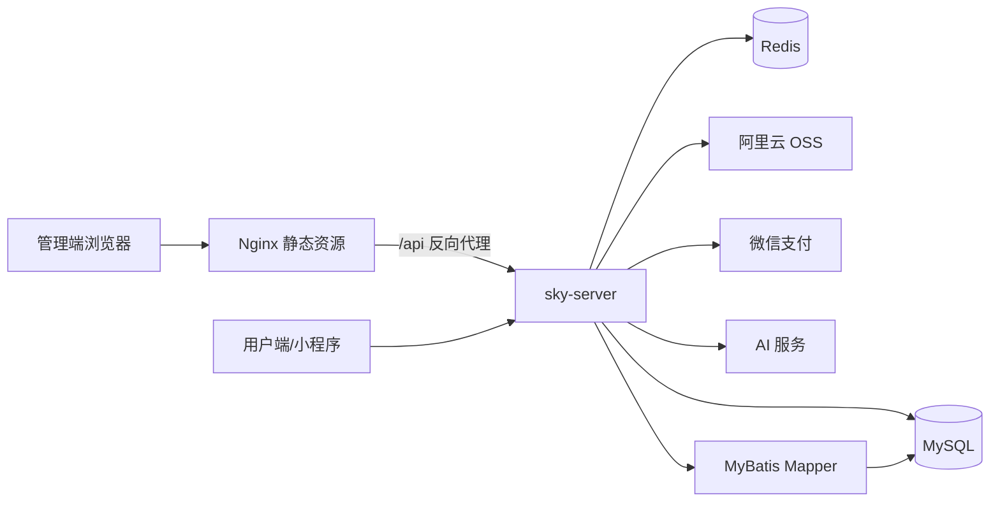

# Sky Take Out 


Sky Take Out 是一个前后端分离的外卖管理系统示例项目。后端基于 Spring Boot + MyBatis，提供员工、菜品、套餐、订单、购物车、地址簿、店铺营业状态等接口；前端是已经构建好的 Vue 管理端静态页面，来自 `D:\nginx-1.20.2\html\sky`，已整理到本仓库的 `frontend/sky-admin` 目录中。

> 安全说明：仓库中的 `application-dev.yml` 已替换为占位配置，不包含真实密钥。真实开发配置请放在本地未跟踪文件 `sky-server/src/main/resources/application-dev.local.yml`，或按需修改后自行保护。

## 界面预览


前端静态资源位于 `frontend/sky-admin`，其中 `index.html` 会加载打包后的 `css`、`js`、`img`、`media` 等资源。前端请求后端接口时使用 `/api` 作为基础路径，因此本地部署时通常需要通过 Nginx 将 `/api` 反向代理到后端服务。

## 技术栈

- 后端：Spring Boot 2.7.3、Spring MVC、MyBatis、PageHelper、Druid、Redis、JWT、Knife4j、WebSocket
- 数据库与中间件：MySQL、Redis
- 文件与第三方能力：阿里云 OSS、微信支付、AI 点餐相关接口封装
- 前端：Vue 构建产物、Element UI 风格管理端页面、Nginx 静态资源部署
- 构建工具：Maven，多模块工程

## 功能模块

- 管理端：员工管理、分类管理、菜品管理、套餐管理、店铺营业状态、公共文件上传
- 用户端：用户登录、地址簿、购物车、菜品/套餐浏览、订单提交与支付流程
- 订单业务：下单、确认、拒单、取消、派送、完成、定时处理超时订单
- 报表与扩展：营业数据、销量、用户统计相关 VO/DTO；AI 点餐服务接口

## 系统结构图



## 项目结构

```text
sky-take-out/
├── README.md
├── pom.xml                         # Maven 父工程
├── sky-common/                     # 通用常量、异常、工具类、配置属性
├── sky-pojo/                       # Entity、DTO、VO 数据模型
├── sky-server/                     # Spring Boot 启动模块与业务代码
│   └── src/main/
│       ├── java/com/sky/
│       │   ├── controller/         # 管理端与用户端接口
│       │   ├── service/            # 业务接口与实现
│       │   ├── mapper/             # MyBatis Mapper 接口
│       │   ├── config/             # Web、Redis、OSS 配置
│       │   ├── interceptor/        # JWT 登录校验拦截器
│       │   ├── aspect/             # 自动填充 AOP
│       │   └── task/               # 定时任务
│       └── resources/
│           ├── mapper/             # MyBatis XML
│           ├── application.yml
│           ├── application-dev.yml
│           └── application-dev.example.yml
└── frontend/
    └── sky-admin/                  # nginx 中的 Vue 管理端构建产物
```

## 本地运行

### 1. 准备环境

- JDK 17
- Maven 3.6+
- MySQL 5.7/8.x
- Redis 5+
- Nginx 1.20.x 或任意静态服务器

### 2. 配置后端

编辑 `sky-server/src/main/resources/application-dev.yml`，将其中的占位值替换为本机配置。建议把真实密钥另存为本地配置并避免提交到 GitHub。

关键配置项：

- `sky.datasource.*`：MySQL 连接信息，默认数据库名为 `sky_take_out`
- `sky.redis.*`：Redis 连接信息
- `sky.alioss.*`：阿里云 OSS 上传配置
- `sky.wechat.*`：微信登录/支付配置
- `sky.ai.key`：AI 点餐接口密钥

### 3. 启动后端

```bash
mvn clean package -DskipTests
mvn -pl sky-server spring-boot:run
```

后端默认监听：`http://localhost:8080`

### 4. 启动前端

方式一：使用仓库中的静态资源。

```text
frontend/sky-admin/index.html
```

方式二：使用本机 nginx，将 `D:\nginx-1.20.2\html\sky` 或仓库中的 `frontend/sky-admin` 配置为静态根目录。

推荐的 Nginx 代理示例：

```nginx
server {
    listen 80;
    server_name localhost;

    location / {
        root D:/nginx-1.20.2/html/sky;
        try_files $uri $uri/ /index.html;
    }

    location /api/ {
        proxy_pass http://localhost:8080/;
        proxy_set_header Host $host;
        proxy_set_header X-Real-IP $remote_addr;
        proxy_set_header X-Forwarded-For $proxy_add_x_forwarded_for;
    }
}
```

访问：`http://localhost/`

## 接口文档

项目集成 Knife4j，后端启动后可访问接口文档页面。常见地址如下，具体以项目配置为准：

```text
http://localhost:8080/doc.html
```

## GitHub 上传说明

本仓库是面向 GitHub 的整理版：

- 已纳入后端 Maven 多模块工程
- 已纳入 nginx 中的前端静态构建产物
- 已补充 README、结构图、运行说明和界面图片
- 已将真实配置替换为占位值，避免敏感信息进入公开仓库
